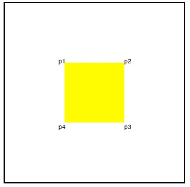
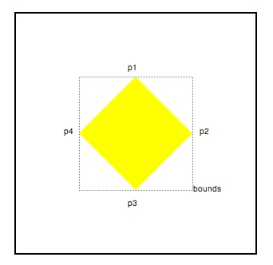
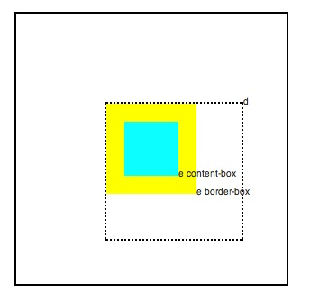

概述
--------------------

前端开发人员经常需要知道一个元素在页面中的绝对位置，或者相对于某个元素的位置。现有的dom api做这些事情有严重的限制。

GeometryUtils 和它支持的api:[DOMPoint, DOMRect and DOMQuad]解决了这些问题。在Firefox 31 Nightly版本汇总首先实现了这些api。

现状
--------------------
现有的获取dom位置的api有element.getBoundingClientRect() 和 element.getClientRects(). 他们返回一个矩形元素相对于可视区域容器的位置。这些api有下面一些限制。

1. CSS transforms获取不正确。
2. 无法获取content-box, padding-box or border-box他们的位置。
3. 无法获取相对于某一个元素的 位置

getBoxQuads()介绍
----------------------------------
 Document, Element and TextNode三种元素实现了 GeometryUtils.getBoxQuads()。他返回 DOMQuads的一个列表，列表的每个元素代表一个对象的css 片段。
 
	 

	 

	 
	 var quads = document.getElementById("d").getBoxQuads();
	// quads.length == 1
	// quads[0].p1.x == 100
	// quads[0].p1.y == 100
	// quads[0].p3.x == 200
	// quads[0].p3.y == 200

使用bounds
----------------------------------
DOMQuad是由定义了任意四边形的四个DOMPoint所组成的集合，它是由getBoxQuads方法返回的四边形的的精确信息，即使是经过2D或者3D变换的，当有一个轴对齐对齐时它有一个bounds属性返回一个DOMRectReadOnly对象，

	

	

	
	var quads = document.getElementById("d").getBoxQuads();
	// quads[0].p1.x == 150
	// quads[0].p1.y == 150 - 50*sqrt(2) (approx)
	// quads[0].p3.x == 150
	// quads[0].p3.y == 150 + 50*sqrt(2) (approx)
	// quads[0].bounds.width == 100*sqrt(2) (approx)

使用参数
-----------------------------------
getBoxQuads() 默认返回的位置是相对于该元素的document的viewport,通过传入的参数可以自定义返回的数据

* box :定义css box的类型，有"content", "padding", "border" or "margin"
* relative to:指相对于哪个元素定位，有 Document, Element or TextNode

		

		

	    

		

		var quads = document.getElementById("e").getBoxQuads({
		  relativeTo:document.getElementById("d")
		});
		// quads[0].p1.x == 0
		// quads[0].p1.y == 0
		 
		quads = document.getElementById("e").getBoxQuads({
		  relativeTo:document.getElementById("d"), 
		  box:"content"
		});
		// quads[0].p1.x == 20
		// quads[0].p1.y == 20
	

